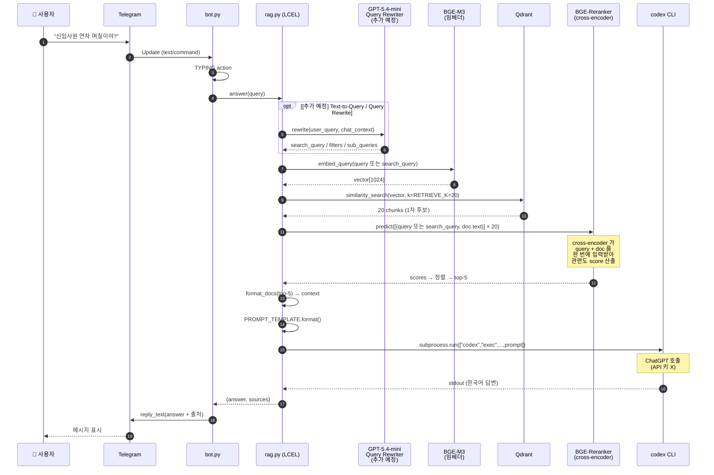
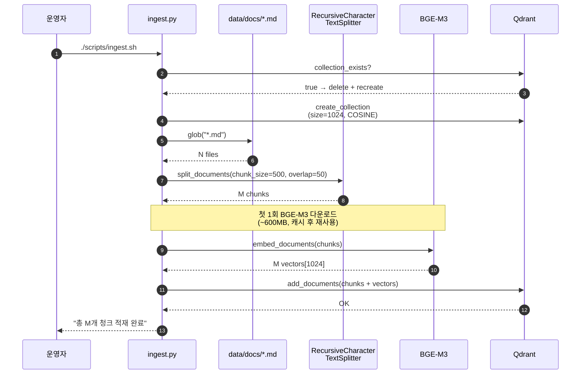
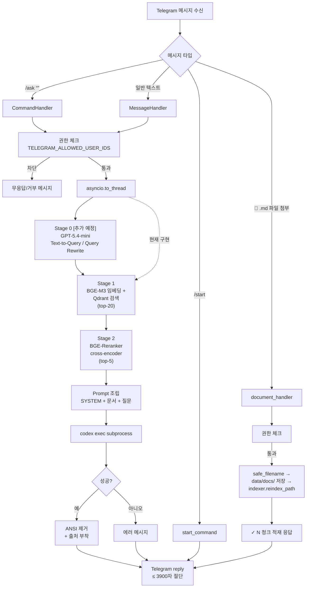

# Telegram RAG Bot — 아키텍처 문서

API 키 없이 로그인된 `codex` CLI 와 로컬 임베딩(BGE-M3) + 로컬 리랭커(BGE-Reranker-v2-m3) 으로 동작하는 사내 문서 RAG 챗봇.
LangChain LCEL 체인 + Qdrant 벡터 DB + python-telegram-bot 으로 구성.

> **이 문서가 어렵다면** → `docs/CONCEPTS.md` 부터 읽으세요. RAG / LangChain / LangGraph / 임베딩 / 리랭커 / 오케스트레이션 개념을 비유와 그림으로 정리한 초심자용 가이드입니다.

---

## 1. 시스템 구성 요약

| 영역 | 기술 | 비고 |
|---|---|---|
| 메신저 | Telegram (`@your_company_docs_bot`) | python-telegram-bot 21.7, long polling |
| 오케스트레이션 | LangChain LCEL (`Runnable*`, `ContextualCompressionRetriever`) | `RunnableParallel`, `RunnableLambda` |
| 임베딩 | `BAAI/bge-m3` (로컬, sentence-transformers) | 1024 dim, 한국어 품질 우수 |
| 벡터 DB | Qdrant 1.12.1 (Podman 컨테이너) | `:6333` HTTP, Cosine distance |
| **리랭커** | **`BAAI/bge-reranker-v2-m3` (로컬, cross-encoder)** | **2단계 정제 (retrieve 20 → rerank top-5)** |
| LLM | `codex exec --skip-git-repo-check` (subprocess) | ChatGPT 인증, Anthropic/OpenAI API 미사용 |
| 호스트 | macOS (Apple Silicon) + Python 3.14 venv | 봇은 호스트 네이티브, Qdrant만 Podman |

**API 키 의존도** = Telegram 봇 토큰 1개만 필요. (LLM·임베딩·리랭커 모두 키 없음)

---

## 2. 컴포넌트 아키텍처

```mermaid
flowchart LR
    User([👤 팀원])
    TG[Telegram<br/>@your_company_docs_bot]

    subgraph Mac["🖥️ 호스트 (Macbook)"]
        subgraph Bot["Python 봇 프로세스 (.venv)"]
            BotPy["bot.py<br/>python-telegram-bot"]
            RagPy["rag.py<br/>LangChain LCEL"]
            BGE[("BGE-M3<br/>임베딩 모델<br/>≈ 600MB RAM")]
            BGER[("BGE-Reranker-v2-m3<br/>cross-encoder<br/>≈ 600MB RAM")]
            BotPy -->|"answer(query)"| RagPy
        end

        Codex[["codex CLI<br/>(ChatGPT 인증)"]]

        subgraph Pod["Podman 컨테이너"]
            Qdrant[(Qdrant<br/>vector DB<br/>:6333)]
        end

        Docs[/"data/docs/<br/>*.md"/]
    end

    User -->|"/ask 질문"| TG
    TG <-->|long polling| BotPy

    RagPy -->|"1️⃣ embed query"| BGE
    BGE -->|"vector(1024d)"| RagPy
    RagPy -->|"2️⃣ similarity search<br/>top-20 후보"| Qdrant
    Qdrant -->|"20 chunks"| RagPy
    RagPy -->|"3️⃣ rerank<br/>(query, doc) pairs"| BGER
    BGER -->|"top-5 정제 결과"| RagPy
    RagPy -->|"4️⃣ subprocess<br/>codex exec"| Codex
    Codex -->|"한국어 답변"| RagPy

    Docs -.watchdog 감지.-> BotPy
    BotPy -.indexer.reindex_path<br/>(증분 upsert).-> Qdrant
    TG -.📎 .md 첨부.-> BotPy
    BotPy -.download +<br/>data/docs 저장.-> Docs
    INGEST[ingest.py<br/>전체 재생성] -.수동 1회.-> Qdrant
```

---

## 3. 질문 처리 시퀀스 (런타임)



응답 시간 (실측 / 추정):
- 첫 질문 (모델 콜드 스타트): **15~30초**
- 이후 질문: **6~12초** (rerank 추가 +1~3초)

---

## 4. 인덱싱 시퀀스 (문서 변경 시)



> 인덱싱 시점에는 **리랭커가 관여하지 않습니다.** 리랭커는 질의 시점에만 동작합니다.

---

## 5. 핸들러 분기 흐름



---

## 6. 데이터 모델

### 6.1 Qdrant 컬렉션 `company_docs`

| 항목 | 값 |
|---|---|
| Vector size | 1024 (BGE-M3 dense) |
| Distance | Cosine |
| Payload 필드 | `page_content` (chunk 본문), `metadata.source` (원본 파일명) |

### 6.2 LangChain Document metadata

```json
{
  "source": "01_hr_vacation.md"
}
```

### 6.3 Retrieval vs Rerank 단계 정리

| 단계 | 하는 일 | 동작 모델 | 입력 → 출력 | 파라미터 |
|---|---|---|---|---|
| **Stage 1: Retrieval** | 의미 유사도로 빠르게 후보 추림 | bi-encoder (BGE-M3) | query 벡터 ↔ 저장된 벡터 cosine | `RETRIEVE_K=20` |
| **Stage 2: Rerank** | 정밀하게 query–doc 관계 점수화 | cross-encoder (BGE-Reranker-v2-m3) | (query, doc) 쌍 → score | `TOP_K=5` |
| **Stage 3: Generate** | 답변 문장 생성 | codex CLI (ChatGPT) | 5 chunks + 질문 → 답변 | `LLM_CLI_TIMEOUT=180s` |

차이 핵심: bi-encoder 는 **벡터 미리 만들어 검색**(빠름), cross-encoder 는 **매번 (q, d) 한 쌍씩 함께 입력**(느리지만 정확).

### 6.4 Chunk / Retrieve / Top-K 운영 기준

#### Chunk 란?

`chunk` 는 원본 문서를 검색하기 좋은 크기로 자른 **본문 조각**입니다.
이 프로젝트는 `.md` 파일 전체를 하나의 벡터로 저장하지 않고, `RecursiveCharacterTextSplitter` 로 여러 chunk 로 나눈 뒤 각 chunk 를 BGE-M3 임베딩 벡터로 만들어 Qdrant 에 저장합니다.

저장 단위:

| 항목 | 의미 |
|---|---|
| `page_content` | chunk 본문 |
| `metadata.source` | 원본 파일명 |
| vector | chunk 본문을 BGE-M3 로 임베딩한 1024차원 벡터 |

질문이 들어오면 시스템은 "어떤 파일이 관련 있는가"가 아니라 **"어떤 chunk 가 질문과 의미상 가까운가"** 를 먼저 찾습니다.

#### 값들의 의미

| 값 | 현재값 | 의미 | 커지면 | 작아지면 | 변경 후 재인덱싱 |
|---|---:|---|---|---|---|
| `CHUNK_SIZE` | `500` | chunk 하나의 최대 길이. 현재 `len()` 기준 문자 수 | 문맥이 넓게 들어가지만 검색 초점이 흐려질 수 있음 | 검색 초점은 선명하지만 문맥이 잘릴 수 있음 | **필요** |
| `CHUNK_OVERLAP` | `50` | 인접 chunk 끼리 겹치는 길이 | 경계에서 문장이 잘리는 문제 완화, 저장량 증가 | 저장량 감소, 경계 손실 증가 | **필요** |
| `RETRIEVE_K` | `20` | Qdrant 1차 검색에서 가져올 후보 chunk 수 | 놓치는 문서가 줄지만 rerank 시간이 증가 | 빨라지지만 좋은 후보를 놓칠 수 있음 | 불필요 |
| `TOP_K` | `5` | reranker 이후 LLM 에 넘길 최종 chunk 수 | 근거가 풍부하지만 프롬프트가 길어지고 잡음 증가 | 답변은 간결해지지만 근거 부족 가능 | 불필요 |

현재 `CHUNK_SIZE`, `CHUNK_OVERLAP` 은 `app/config.py` 의 코드 상수입니다.
`RETRIEVE_K`, `TOP_K` 는 `.env` 로 조정할 수 있습니다.
chunk 값을 운영 중 자주 바꿔야 한다면 `CHUNK_SIZE=int(os.getenv("CHUNK_SIZE", "500"))` 처럼 환경변수화하는 것이 좋습니다.

`RETRIEVE_K` 는 정확도 점수가 아닙니다.
정확도 자체를 의미하는 값이 아니라, **정확한 chunk 를 찾기 위해 1차 후보를 얼마나 넓게 가져올지 정하는 후보 수**입니다.

현재 흐름은 다음과 같습니다.

```text
문서 원본
  → CHUNK_SIZE / CHUNK_OVERLAP 기준으로 chunk 생성
  → 각 chunk 임베딩 후 Qdrant 저장
  → 질문 시 Qdrant 에서 RETRIEVE_K 개 후보 검색
  → reranker 가 후보를 다시 점수화
  → TOP_K 개만 LLM 프롬프트에 포함
```

#### 재인덱싱 기준

`CHUNK_SIZE` 나 `CHUNK_OVERLAP` 을 바꾸면 chunk 경계와 개수가 달라집니다.
즉, 벡터 DB 에 저장된 `page_content` 와 vector 자체가 달라져야 하므로 **반드시 재인덱싱이 필요**합니다.

```bash
./scripts/ingest.sh
```

반면 `RETRIEVE_K`, `TOP_K`, `RERANKER_ENABLED` 는 질의 시점 동작을 바꾸는 값입니다.
기존 chunk 와 vector 는 그대로 사용할 수 있으므로 재인덱싱은 필요 없고, 봇 프로세스만 재시작하면 됩니다.

#### 문서 유형별 권장값

| 문서 유형 | `CHUNK_SIZE` | `CHUNK_OVERLAP` | `RETRIEVE_K` | `TOP_K` | 운영 기준 |
|---|---:|---:|---:|---:|---|
| FAQ, 짧은 정책, 사내 규정 | 300~600 | 30~80 | 15~25 | 3~5 | 질문 하나가 보통 한 단락에 대응. 현재 기본값에 가장 잘 맞음 |
| 업무 매뉴얼, 온보딩 문서 | 600~900 | 80~120 | 20~40 | 5~7 | 절차가 여러 문단에 걸리므로 chunk 를 약간 키움 |
| 장애 대응, 운영 Runbook | 800~1200 | 100~200 | 30~50 | 5~8 | 증상, 원인, 조치 절차가 함께 들어와야 함 |
| API 스펙, 설정 레퍼런스 | 700~1500 | 100~200 | 30~50 | 5~8 | 필드 설명과 예시 코드가 분리되지 않게 유지 |
| 매우 짧은 공지 모음 | 200~400 | 20~50 | 10~20 | 3~4 | chunk 가 너무 크면 서로 다른 공지가 섞여 오탐 증가 |

#### 시스템 사양별 권장값

| 운영 목표 / 사양 | 권장값 |
|---|---|
| 저사양 CPU, 응답 속도 우선 | `RETRIEVE_K=10~15`, `TOP_K=3~4` |
| 일반 로컬 Mac, reranker 사용 | `RETRIEVE_K=20~30`, `TOP_K=5` |
| 정확도 우선, 문서 수 많음 | `RETRIEVE_K=40~60`, `TOP_K=6~8` |
| 리랭커 OFF | `TOP_K=5~8`, `RETRIEVE_K` 는 사용되지 않음 |

#### 튜닝 순서

1. 답변이 관련 문서를 자주 못 찾으면 `RETRIEVE_K` 를 먼저 올립니다. 예: `20 → 30`.
2. 검색은 되지만 답변 근거가 부족하면 `TOP_K` 를 올립니다. 예: `5 → 7`.
3. 답변에 서로 다른 주제가 섞이면 `CHUNK_SIZE` 를 줄입니다. 예: `800 → 500`.
4. 문장이나 절차가 중간에 끊겨 답변이 불완전하면 `CHUNK_OVERLAP` 을 늘립니다. 예: `50 → 100`.
5. `CHUNK_SIZE` 또는 `CHUNK_OVERLAP` 을 바꾼 뒤에는 `./scripts/ingest.sh` 로 전체 재인덱싱합니다.

운영 기본값은 사내 FAQ/정책 문서 기준으로 `CHUNK_SIZE=500`, `CHUNK_OVERLAP=50`, `RETRIEVE_K=20`, `TOP_K=5` 를 권장합니다.
문서가 길고 절차 중심으로 바뀌면 `CHUNK_SIZE=800`, `CHUNK_OVERLAP=100`, `RETRIEVE_K=30`, `TOP_K=5~7` 부터 시험하는 것이 좋습니다.

### 6.5 임베딩 / 리랭커 모델 선택 기준

이 프로젝트의 기본 모델은 다음 조합입니다.

| 역할 | 기본 모델 | 설정값 |
|---|---|---|
| 임베딩 | [`BAAI/bge-m3`](https://huggingface.co/BAAI/bge-m3) | `EMBEDDING_MODEL=BAAI/bge-m3`, `EMBEDDING_DIM=1024` |
| 리랭커 | [`BAAI/bge-reranker-v2-m3`](https://huggingface.co/BAAI/bge-reranker-v2-m3) | `RERANKER_MODEL=BAAI/bge-reranker-v2-m3` |

#### 현재 모델을 선택한 이유

| 기준 | 판단 |
|---|---|
| 한국어/다국어 문서 대응 | BGE-M3 는 100개 이상 언어를 지원하는 다국어 임베딩 모델이고, 사내 문서가 한국어 중심이어도 영어 기술 용어가 섞이는 환경에 적합 |
| 긴 문서 대응 | BGE-M3 는 최대 8192 토큰 입력을 지원하므로 짧은 FAQ 부터 긴 운영 문서까지 대응 폭이 넓음 |
| 로컬 실행 | 임베딩과 리랭커 모두 HuggingFace 모델로 로컬 실행 가능. OpenAI/Anthropic API 키 없이 운영 가능 |
| 구현 단순성 | 현재 코드의 `HuggingFaceEmbeddings`, `HuggingFaceCrossEncoder` 로 바로 사용할 수 있음 |
| 조합 일관성 | 리랭커가 BGE-M3 계열이라 임베딩 모델과 검색 목적이 잘 맞음 |
| 성능/운영 균형 | Qwen3 4B/8B 같은 대형 모델보다 절대 성능은 낮을 수 있지만, 로컬 CPU/Mac 환경에서 설치와 운영이 단순함 |

즉, 이 선택은 "항상 최고 점수의 모델"이라기보다 **한국어 사내 문서 RAG 를 로컬에서 안정적으로 운영하기 위한 균형점**입니다.

#### 임베딩 모델 후보

| 후보 | 차원 | 장점 | 단점 / 주의 | 현재 코드와의 호환성 |
|---|---:|---|---|---|
| [`BAAI/bge-m3`](https://huggingface.co/BAAI/bge-m3) | 1024 | 다국어, 긴 입력, dense/sparse/multi-vector 지원, 현재 기본값 | 모델이 아주 작지는 않음 | **바로 사용 중** |
| [`intfloat/multilingual-e5-large`](https://huggingface.co/intfloat/multilingual-e5-large) | 1024 | 94개 언어, 널리 쓰이는 다국어 retrieval 모델, 같은 1024차원 | E5 계열은 `query:` / `passage:` prefix 를 맞추는 것이 권장됨. 현재 코드에는 prefix 처리가 없음 | 로드는 가능하나 품질 최적화에는 코드 수정 권장 |
| [`intfloat/multilingual-e5-large-instruct`](https://huggingface.co/intfloat/multilingual-e5-large-instruct) | 1024 | instruction 기반 검색 품질 기대, 다국어 | instruction/prompt 형식 반영 필요. 단순 교체만으로 최적 성능이 아닐 수 있음 | 코드 수정 권장 |
| [`sentence-transformers/paraphrase-multilingual-mpnet-base-v2`](https://huggingface.co/sentence-transformers/paraphrase-multilingual-mpnet-base-v2) | 768 | sentence-transformers 호환성이 좋고 비교적 단순, 50개 언어 지원 | 검색 전용 최신 모델보다 retrieval 성능이 낮을 수 있음. 차원 변경 필요 | 환경변수 교체 가능, 재인덱싱 필요 |
| [`Alibaba-NLP/gte-multilingual-base`](https://huggingface.co/Alibaba-NLP/gte-multilingual-base) | 768 | 70개 이상 언어, 긴 입력, 최신 계열, elastic dense 지원 | `trust_remote_code=True` 필요. 현재 `get_embeddings()` 코드 수정 필요 | 코드 수정 필요 |
| [`jinaai/jina-embeddings-v3`](https://huggingface.co/jinaai/jina-embeddings-v3) | 1024 | 다국어, 긴 입력, task LoRA 지원 | 라이선스가 CC-BY-NC-4.0 이라 상업/사내 사용 정책 확인 필요. `trust_remote_code` 등 추가 설정 가능성 | 코드/라이선스 확인 필요 |
| [`Qwen/Qwen3-Embedding-0.6B`](https://huggingface.co/Qwen/Qwen3-Embedding-0.6B) | 1024 | 100개 이상 언어, 32k 컨텍스트, MTEB 다국어 성능 우수, 사용자 정의 차원 지원 | 더 무겁고 instruction 설정이 중요함. 현재 `HuggingFaceEmbeddings` 단순 래퍼로는 최적 구성이 아님 | 코드 수정 권장 |

운영 추천:

| 상황 | 추천 |
|---|---|
| 현재처럼 한국어 사내 문서 + 로컬 운영 | `BAAI/bge-m3` 유지 |
| 같은 1024차원에서 대안 실험 | `multilingual-e5-large` 또는 `Qwen3-Embedding-0.6B` 비교 테스트 |
| 메모리/속도 우선 | `paraphrase-multilingual-mpnet-base-v2` 같은 768차원 모델 검토 |
| 최신 고성능 실험 | Qwen3 / GTE 계열을 별도 브랜치에서 코드 수정 후 검증 |

#### 리랭커 모델 후보

리랭커는 임베딩처럼 벡터를 저장하지 않습니다.
질문 시점에 `(query, chunk)` 쌍을 직접 입력받아 관련도 점수를 계산합니다.
따라서 리랭커 모델만 바꾸는 경우에는 **재인덱싱이 필요 없습니다.**

| 후보 | 장점 | 단점 / 주의 | 현재 코드와의 호환성 |
|---|---|---|---|
| [`BAAI/bge-reranker-v2-m3`](https://huggingface.co/BAAI/bge-reranker-v2-m3) | 다국어, BGE-M3 계열, 비교적 가벼움, 현재 기본값 | 더 큰 LLM reranker 대비 최고 성능은 아닐 수 있음 | **바로 사용 중** |
| `BAAI/bge-reranker-base` / `BAAI/bge-reranker-large` | cross-encoder 구조가 단순하고 빠른 편 | 주로 중국어/영어 중심. 한국어 사내 문서에는 기본값보다 이점이 작을 수 있음 | 환경변수 교체 가능성 높음 |
| `BAAI/bge-reranker-v2-gemma` | 다국어 성능 기대, BGE 문서에서 고성능 후보로 언급 | 더 무겁고 LLM 기반 사용 방식이 필요할 수 있음 | 코드 수정/성능 검증 필요 |
| [`Alibaba-NLP/gte-multilingual-reranker-base`](https://huggingface.co/Alibaba-NLP/gte-multilingual-reranker-base) | 75개 언어, 최신 multilingual reranker 계열 | `trust_remote_code` 등 커스텀 로딩 가능성. 현재 LangChain CrossEncoder 경로와 바로 맞는지 검증 필요 | 코드 수정 가능성 높음 |
| [`jinaai/jina-reranker-v2-base-multilingual`](https://huggingface.co/jinaai/jina-reranker-v2-base-multilingual) | 다국어 cross-encoder, 코드/SQL/도구 검색 벤치마크 강점 | CC-BY-NC-4.0 라이선스. `trust_remote_code`, flash attention 옵션 등 추가 고려 필요 | 코드 수정/라이선스 확인 필요 |
| [`Qwen/Qwen3-Reranker-0.6B`](https://huggingface.co/Qwen/Qwen3-Reranker-0.6B) | 100개 이상 언어, 32k 컨텍스트, Qwen3 embedding 과 조합 가능 | 생성형/LLM reranker 방식이라 현재 `HuggingFaceCrossEncoder` 단순 교체 대상이 아님. 더 무거움 | 코드 수정 필요 |

운영 추천:

| 상황 | 추천 |
|---|---|
| 안정 운영 | `BAAI/bge-reranker-v2-m3` 유지 |
| 속도 우선 | `RERANKER_ENABLED=false` 로 끄고 `TOP_K` 를 5~8 로 조정 |
| 정확도 우선 | `RETRIEVE_K` 를 30~50 으로 올린 뒤 기본 reranker 유지 |
| 최신 reranker 실험 | Qwen3 / GTE / Jina 계열은 별도 브랜치에서 래퍼 코드 수정 후 A/B 테스트 |

#### 모델 변경 방법

##### 1. 임베딩 모델 변경

`.env` 에서 임베딩 모델명과 차원을 함께 바꿉니다.

```bash
# 예: 같은 1024차원 모델로 변경
EMBEDDING_MODEL=intfloat/multilingual-e5-large
EMBEDDING_DIM=1024
```

```bash
# 예: 768차원 모델로 변경
EMBEDDING_MODEL=sentence-transformers/paraphrase-multilingual-mpnet-base-v2
EMBEDDING_DIM=768
```

그 다음 전체 재인덱싱이 필요합니다.

```bash
./scripts/stop.sh
./scripts/ingest.sh
nohup ./scripts/run.sh > bot.log 2>&1 & disown
```

임베딩 모델을 바꾸면 기존 Qdrant vector 와 새 query vector 가 서로 다른 공간의 값이 됩니다.
차원이 같더라도 의미 공간이 다르므로 **항상 전체 재인덱싱**해야 합니다.
차원이 달라지면 Qdrant 컬렉션의 vector size 도 바뀌어야 하므로 `EMBEDDING_DIM` 을 반드시 맞춥니다.

##### 2. 리랭커 모델 변경

`.env` 에서 리랭커 모델만 바꿉니다.

```bash
RERANKER_ENABLED=true
RERANKER_MODEL=BAAI/bge-reranker-v2-m3
```

리랭커 모델만 바꾼 경우에는 재인덱싱이 필요 없습니다.
봇만 재시작하면 됩니다.

```bash
./scripts/stop.sh
nohup ./scripts/run.sh > bot.log 2>&1 & disown
```

속도 우선으로 리랭커를 끄려면:

```bash
RERANKER_ENABLED=false
TOP_K=5
```

리랭커를 끄면 Qdrant 검색 결과가 바로 LLM 에 들어갑니다.
응답은 빨라지지만, 의미가 비슷한 오답 chunk 를 걸러내는 능력은 약해집니다.

##### 3. 코드 수정이 필요한 모델을 쓰는 경우

다음 조건 중 하나라도 있으면 `.env` 만 바꾸지 말고 코드 수정이 필요합니다.

| 조건 | 수정 지점 |
|---|---|
| 모델 카드가 `trust_remote_code=True` 를 요구 | `app/embeddings.py` 또는 `app/rag.py` 의 모델 로딩 옵션 |
| E5 계열처럼 query/passage prefix 가 필요한 모델 | 문서 임베딩 시 `passage:` prefix, 질문 임베딩 시 `query:` prefix 처리 |
| Qwen3 reranker 처럼 CrossEncoder 가 아닌 LLM/generative reranker | `app/rag.py` 의 `HuggingFaceCrossEncoder` / `CrossEncoderReranker` 교체 |
| 모델 차원이 1024가 아님 | `.env` 의 `EMBEDDING_DIM` 변경 후 `./scripts/ingest.sh` |
| 라이선스가 non-commercial | 사내 사용 가능 여부 확인 후 도입 |

모델 교체 후에는 최소한 `tests/scenarios.md` 의 대표 질문으로 기존 모델과 답변 품질을 비교합니다.
운영 판단은 단일 질문 체감보다 **정답률, 출처 정확도, 평균 응답 시간, 메모리 사용량**을 같이 봐야 합니다.

### 6.6 Text-to-Query / Query Rewrite [추가 예정]

현재 구현은 사용자의 질문 원문을 바로 임베딩합니다.
즉, GPT 가 VectorDB 검색 쿼리를 만들지 않고 `BGE-M3` 가 질문 텍스트를 query vector 로 변환합니다.

현재 구현:

```text
사용자 질문
  → BGE-M3 embed_query(question)
  → Qdrant similarity_search
  → BGE-Reranker
  → codex CLI 최종 답변
```

추가 예정 구조:

```text
사용자 질문
  → GPT-5.4-mini Query Rewriter [추가 예정]
  → search_query / filters / sub_queries 생성
  → BGE-M3 embed_query(search_query)
  → Qdrant similarity_search
  → BGE-Reranker
  → codex CLI 최종 답변
```

#### 왜 추가하나?

현업 RAG 에서 "text-to-query 가 중요하다"는 말은 보통 사용자의 자연어를 검색 시스템이 더 잘 이해하는 형태로 바꾸는 단계를 뜻합니다.
VectorDB 에서는 SQL 을 만드는 것이 아니라 **검색용 문장, 키워드, 필터, 하위 질문**을 만드는 쪽에 가깝습니다.

예시:

```text
사용자 질문:
"신입도 그거 쓸 수 있어?"

대화 맥락:
"연차 휴가"

검색용 query:
"신입사원의 연차 휴가 사용 가능 여부, 발생 기준, 사용 조건"
```

이 단계가 특히 유용한 경우:

| 상황 | Query Rewrite 효과 |
|---|---|
| 대명사/생략이 많음 | "그거", "저번에 말한 것" 같은 표현을 명시적 검색어로 복원 |
| 질문이 너무 짧음 | 검색에 필요한 도메인 키워드를 보강 |
| 여러 질문이 섞임 | 2~3개 하위 검색 쿼리로 분해 |
| 문서 metadata 가 있음 | `category=hr`, `source contains vpn` 같은 필터 추출 |
| 한국어 질문에 영어 기술 용어가 필요 | "배포 승인" → "deployment approval" 같은 동의어 확장 |

주의할 점:

| 리스크 | 대응 |
|---|---|
| LLM 이 원래 의도를 바꿀 수 있음 | 원문 query 와 rewrite query 를 둘 다 검색하고 결과를 합침 |
| 매 질문마다 LLM 호출 비용/시간 증가 | 질문이 짧거나 모호할 때만 rewrite 실행하거나 timeout 을 짧게 둠 |
| JSON 파싱 실패 | 실패 시 원문 검색으로 fallback |
| 잘못된 filter 로 정답 문서 제외 | 초반에는 filter 를 강제 적용하지 않고 soft signal 로만 사용 |

#### 현업에서 많이 쓰는 Query Rewrite 프롬프트

실무에서는 자유 문장보다 JSON 으로 짧게 받는 방식을 선호합니다.
파싱이 쉽고, 실패 시 fallback 하기도 쉽기 때문입니다.

```text
You are a search query rewriting component for an internal RAG system.

Goal:
- Convert the user's Korean question into a precise search query for document retrieval.
- Do not answer the question.
- Do not invent facts.
- Preserve the user's original intent.
- Expand vague references only when the chat context makes them clear.
- Return JSON only.

Inputs:
<chat_context>
{chat_context}
</chat_context>

<user_question>
{question}
</user_question>

Return this JSON schema:
{
  "search_query": "검색에 사용할 한 문장",
  "keywords": ["핵심 키워드", "동의어", "문서에 나올 법한 표현"],
  "sub_queries": ["필요한 경우 하위 검색 질문 1", "하위 검색 질문 2"],
  "filters": {
    "category": null,
    "source_hint": null,
    "date_hint": null
  },
  "confidence": 0.0
}

Rules:
- `search_query` must be Korean unless English technical terms are necessary.
- Keep `search_query` under 120 characters.
- Use null for unknown filters.
- If the question is already clear, rewrite minimally.
- If confidence is below 0.5, keep the original question as `search_query`.
```

예상 출력:

```json
{
  "search_query": "신입사원의 연차 휴가 사용 가능 여부와 발생 기준",
  "keywords": ["신입사원", "연차", "휴가", "발생 기준", "사용 조건"],
  "sub_queries": [],
  "filters": {
    "category": "hr",
    "source_hint": null,
    "date_hint": null
  },
  "confidence": 0.86
}
```

#### Text-to-SQL 과의 차이

Text-to-SQL 은 사용자의 자연어를 실제 SQL 로 바꾸는 패턴입니다.
사내 문서 RAG 의 VectorDB 검색과는 목적이 다릅니다.

| 구분 | VectorDB RAG Query Rewrite | Text-to-SQL |
|---|---|---|
| 대상 | Qdrant 같은 VectorDB | PostgreSQL/MySQL/BigQuery 같은 RDB |
| 출력 | 검색용 문장, 키워드, 필터 | `SELECT ... FROM ... WHERE ...` |
| 검증 기준 | 관련 chunk 를 잘 찾는가 | SQL 이 안전하고 정확하게 실행되는가 |
| 위험 | 의도 왜곡, 잘못된 필터 | 데이터 유출, 무거운 쿼리, SQL injection, 잘못된 집계 |
| 이 프로젝트 적용 | **추가 예정** | 현재 적용 대상 아님 |

그래도 현업에서는 Text-to-SQL 프롬프트를 다음처럼 엄격하게 씁니다.

```text
You are a read-only SQL generator.

Task:
- Convert the user question into a single safe SELECT query.
- Use only the tables and columns in the provided schema.
- Do not generate INSERT, UPDATE, DELETE, DROP, ALTER, TRUNCATE, CREATE, GRANT, or CALL.
- Do not use tables or columns that are not in the schema.
- Add a LIMIT unless the user explicitly asks for an aggregate count.
- Return JSON only.

Schema:
{schema}

Business rules:
{business_rules}

User question:
{question}

Return:
{
  "sql": "SELECT ...",
  "params": {},
  "explanation": "짧은 한국어 설명",
  "confidence": 0.0
}
```

Text-to-SQL 은 보통 바로 실행하지 않습니다.
현업에서는 다음 방어 단계를 둡니다.

1. SQL parser 로 `SELECT` 만 허용
2. 접근 가능한 테이블/컬럼 allowlist 검증
3. `LIMIT` 강제
4. 쿼리 실행 전 비용/timeout 제한
5. 개인정보 컬럼 masking 또는 차단
6. 실패 시 "쿼리를 생성할 수 없음" 으로 종료

이 프로젝트는 문서 RAG 이므로 Text-to-SQL 자체를 바로 넣기보다는, 먼저 VectorDB 용 Query Rewrite 를 추가하는 것이 맞습니다.

#### 구현 예정안

1차 구현은 안전하게 **원문 검색 + rewrite 검색 병합**으로 갑니다.
rewrite 가 실패하거나 품질이 낮아도 원문 검색 결과가 남도록 하기 위함입니다.

```text
answer(question)
  → rewrite_query(question) [추가 예정, GPT-5.4-mini]
  → original_docs = retriever.invoke(question)
  → rewritten_docs = retriever.invoke(search_query)
  → merge + dedupe by page_content/source
  → reranker top-k
  → final answer prompt
```

예정 파일 구조:

| 파일 | 예정 변경 |
|---|---|
| `app/query_rewriter.py` | GPT-5.4-mini 호출, JSON 파싱, fallback 로직 |
| `app/config.py` | `QUERY_REWRITE_ENABLED`, `QUERY_REWRITE_MODEL`, `QUERY_REWRITE_TIMEOUT` 추가 |
| `app/rag.py` | 검색 전 rewrite 호출, 원문/재작성 query 검색 결과 병합 |
| `docs/ARCHITECTURE.md` | 본 섹션을 구현 상태에 맞춰 갱신 |

예정 환경변수:

```bash
QUERY_REWRITE_ENABLED=false
QUERY_REWRITE_MODEL=gpt-5.4-mini
QUERY_REWRITE_TIMEOUT=15
QUERY_REWRITE_MIN_CONFIDENCE=0.5
```

현재 프로젝트는 LLM 을 `codex` CLI 로 호출하므로, 구현 시에는 두 가지 선택지가 있습니다.

| 방식 | 장점 | 단점 |
|---|---|---|
| `codex exec -m gpt-5.4-mini` 를 query rewrite 에도 사용 | API 키 없이 현재 구조 유지 | 매 질문마다 subprocess 비용이 있어 느릴 수 있음 |
| OpenAI API 로 GPT-5.4-mini 직접 호출 | 빠르고 JSON schema/timeout 제어가 쉬움 | API 키와 비용 관리 필요 |

초기 구현은 비용과 구조 일관성을 위해 `codex exec -m gpt-5.4-mini -c model_reasoning_effort=low` 를 사용하고, 응답 지연이 문제 되면 API 호출 방식으로 분리하는 것이 현실적입니다.

#### 운영 판단 기준

Query Rewrite 를 켠 뒤에는 다음 지표를 비교합니다.

| 지표 | 확인 방법 |
|---|---|
| 정답률 | `tests/scenarios.md` 질문별 expected answer 충족 여부 |
| 출처 정확도 | 답변 출처가 실제 근거 문서인지 확인 |
| 검색 재현율 | 기존 원문 검색에서 못 찾던 문서를 rewrite 로 찾는지 확인 |
| 응답 시간 | rewrite 추가 전/후 평균 latency 비교 |
| 실패율 | JSON 파싱 실패, timeout, fallback 비율 |

기본 운영 원칙은 **rewrite 는 검색 보조 수단이고, 최종 답변은 반드시 검색된 문서에 근거한다**입니다.

---

## 7. 환경변수 (.env)

| 키 | 필수 | 기본값 | 설명 |
|---|---|---|---|
| `TELEGRAM_BOT_TOKEN` | ✓ | - | BotFather 발급 토큰 |
| `TELEGRAM_ALLOWED_USER_IDS` | 선택 | (전체 허용) | 콤마 구분 user id 화이트리스트 |
| `QDRANT_URL` | 선택 | `http://localhost:6333` | Qdrant 엔드포인트 |
| `COLLECTION_NAME` | 선택 | `company_docs` | 컬렉션명 |
| `LLM_CLI` | 선택 | `codex` | LLM CLI 실행파일 (claude / gemini 교체 가능) |
| `LLM_CLI_ARGS` | 선택 | `exec --skip-git-repo-check` | 공백 구분 인자 |
| `LLM_CLI_TIMEOUT` | 선택 | `180` | CLI 호출 타임아웃(s) |
| `EMBEDDING_MODEL` | 선택 | `BAAI/bge-m3` | HuggingFace 임베딩 모델명 (변경 시 재인덱싱 필요) |
| `EMBEDDING_DIM` | 선택 | `1024` | 모델 차원 (변경 시 재인덱싱 필요) |
| **`RERANKER_ENABLED`** | 선택 | **`true`** | **`false` 면 단일 단계로 fallback** |
| **`RERANKER_MODEL`** | 선택 | **`BAAI/bge-reranker-v2-m3`** | **HuggingFace cross-encoder (변경 시 봇 재시작 필요)** |
| **`RETRIEVE_K`** | 선택 | **`20`** | **Stage 1 후보 수 (rerank 입력)** |
| `TOP_K` | 선택 | `5` | Stage 2 최종 청크 수 (LLM 입력) |

---

## 8. 디렉토리 트리

```
telegram-langchain-docs/
├── docker-compose.yml          # Qdrant 1개 서비스 (podman compose 호환)
├── .env                        # 토큰·LLM_CLI·리랭커 설정 (gitignore)
├── .env.example
├── .gitignore
├── README.md
│
├── docs/
│   └── ARCHITECTURE.md         # 본 문서
│
├── scripts/
│   ├── _lib.sh                 # docker/podman 자동감지 + DOCKER_HOST 보정
│   ├── setup.sh                # 1회성: venv·pip·Qdrant 기동
│   ├── ingest.sh               # 문서 인덱싱
│   ├── run.sh                  # 봇 포그라운드 실행
│   └── stop.sh                 # 백그라운드 봇 종료
│
├── app/                        # 호스트 네이티브 실행
│   ├── main.py                 # 진입점 (Python 3.14 asyncio fix 포함)
│   ├── bot.py                  # python-telegram-bot 핸들러 + 문서 첨부 핸들러 + watcher 라이프사이클
│   ├── rag.py                  # LangChain LCEL + 리랭커 + codex subprocess
│   ├── embeddings.py           # BGE-M3 싱글톤 (rag.py + indexer.py 공유)
│   ├── indexer.py              # 증분 인덱싱 (source 별 delete + add)
│   ├── watcher.py              # watchdog Observer (data/docs/ 자동 감시)
│   ├── ingest.py               # 전체 재생성 (수동 1회용)
│   ├── config.py               # .env 로딩
│   └── requirements.txt
│
├── data/
│   ├── docs/                   # 사내 문서 (마크다운). 새 문서 여기에 추가.
│   │   ├── 01_hr_vacation.md
│   │   ├── 02_it_vpn.md
│   │   ├── 03_it_account.md
│   │   ├── 04_office_facility.md
│   │   └── 05_dev_deployment.md
│   └── qdrant_storage/         # Podman 볼륨 (자동 생성)
│
└── tests/
    └── scenarios.md            # 13개 테스트 시나리오
```

---

## 9. 환경 의존성 우회 (이번 빌드에서 발견·해결)

| 이슈 | 원인 | 본 프로젝트 대응 |
|---|---|---|
| `docker info` 가 bash 서브쉘에서 실패 | `docker` 가 zsh alias `=podman` (alias는 서브쉘 미상속) | `_lib.sh::detect_container_cli()` 에서 docker→podman 자동 fallback |
| `podman compose` 가 `unix:///tmp/podman.sock` 못 찾음 | 사용자 셸 `DOCKER_HOST` 가 잘못된 경로 | `_lib.sh` 에서 `podman machine inspect` 로 실제 socket 조회 후 `DOCKER_HOST` 재설정 |
| codex `Not inside a trusted directory` | codex CLI 안전 체크 (비-git 디렉토리 거부) | `LLM_CLI_ARGS=exec --skip-git-repo-check` 기본 적용 |
| `RuntimeError: There is no current event loop` | Python 3.14 에서 `asyncio.get_event_loop()` 자동 생성 제거됨 + ptb 21.7 의 `run_polling()` 동기 wrapper 호환 깨짐 | `main.py` 에서 `asyncio.set_event_loop(asyncio.new_event_loop())` 명시 |

---

## 10. 운영 스크립트 사용법

`scripts/` 아래 스크립트는 **최초 구축**, **문서 인덱싱**, **봇 실행**, **봇 종료**, **공통 헬퍼**로 역할이 나뉩니다.

### 10.1 스크립트별 역할

| 스크립트 | 직접 실행 여부 | 언제 사용 | 하는 일 |
|---|---|---|---|
| `scripts/setup.sh` | 직접 실행 | 최초 구축, 의존성 재설치가 필요할 때 | `.env` 존재 확인, `codex` CLI 확인, Docker/Podman 확인, `.venv` 생성, Python 패키지 설치, Qdrant 기동 |
| `scripts/ingest.sh` | 직접 실행 | 최초 문서 적재, 전체 문서 재인덱싱, chunk 설정 변경 후 | Qdrant 기동 확인 후 `data/docs/*.md` 전체를 chunk 로 나누고 BGE-M3 임베딩을 만들어 Qdrant 에 새로 적재 |
| `scripts/run.sh` | 직접 실행 | 봇을 포그라운드로 실행할 때, 운영 시작/재시작 시 | `.venv`, `.env`, `codex` 확인, Qdrant 기동 확인, 컬렉션 존재 여부 경고, `python app/main.py` 실행 |
| `scripts/stop.sh` | 직접 실행 | 백그라운드로 띄운 봇을 종료할 때 | `python app/main.py` 프로세스를 찾아 종료. 정상 종료 실패 시 `pkill -9` 로 강제 종료 |
| `scripts/_lib.sh` | 직접 실행하지 않음 | 다른 스크립트가 내부에서 `source` | 로그 출력 함수, Docker/Podman 자동 감지, Podman `DOCKER_HOST` 보정, Qdrant 기동/헬스체크 공통 로직 |

### 10.2 최초 구축 순서

처음 구축하는 경우에는 **`run.sh` 만 실행하면 안 됩니다.**
`run.sh` 는 이미 `.venv` 와 패키지가 준비되어 있다는 전제로 동작하며, 문서를 Qdrant 에 인덱싱하지도 않습니다.

최초 1회 권장 순서:

```bash
# 0) .env 준비
cp .env.example .env
# .env 안에 TELEGRAM_BOT_TOKEN 등 필요한 값 작성

# 1) 의존성 / Qdrant 준비
./scripts/setup.sh

# 2) 사내 문서 전체 인덱싱
./scripts/ingest.sh

# 3) 봇 실행
./scripts/run.sh
```

`setup.sh` 마지막에도 다음 단계로 `ingest.sh`, `run.sh` 실행을 안내합니다.
BGE-M3 임베딩 모델은 `ingest.sh` 실행 중 최초 1회 다운로드됩니다.

### 10.3 `run.sh` 만 실행해도 되는 경우

다음 조건을 이미 만족하면 `run.sh` 만 실행해도 됩니다.

| 조건 | 이유 |
|---|---|
| `.env` 가 존재함 | Telegram 토큰, Qdrant 주소, LLM CLI 설정을 읽어야 함 |
| `.venv` 가 존재하고 패키지가 설치되어 있음 | `python-telegram-bot`, LangChain, Qdrant client, sentence-transformers 등이 필요 |
| Qdrant 가 기동 가능함 | `run.sh` 가 Qdrant 를 확인하고 꺼져 있으면 컨테이너를 기동함 |
| `company_docs` 컬렉션이 이미 인덱싱되어 있음 | 문서 검색 대상이 있어야 정상 답변 가능 |
| `codex` CLI 가 로그인되어 있음 | LLM 응답 생성 단계에서 `codex exec` 를 호출함 |

`run.sh` 는 Qdrant 컬렉션이 없으면 실행을 막지는 않고 경고만 출력합니다.
이 상태로 봇을 띄우면 질문을 받아도 관련 문서를 못 찾거나 빈 검색 결과가 나올 수 있으므로, 최초 구축 후에는 반드시 `ingest.sh` 를 먼저 실행합니다.

### 10.4 평소 운영 패턴

#### 봇을 포그라운드로 실행

터미널을 열어둔 채 운영하거나 디버깅할 때 사용합니다.
`Ctrl+C` 로 종료합니다.

```bash
./scripts/run.sh
```

#### 봇을 백그라운드로 실행

터미널을 닫아도 봇이 계속 떠 있어야 할 때 사용합니다.

```bash
nohup ./scripts/run.sh > bot.log 2>&1 & disown
```

로그 확인:

```bash
tail -f bot.log
```

백그라운드 봇 종료:

```bash
./scripts/stop.sh
```

### 10.5 문서 변경 시 어떤 스크립트를 쓰나

문서 변경 방식에 따라 다릅니다.

| 상황 | 권장 동작 |
|---|---|
| `data/docs/` 에 `.md` 파일을 추가/수정했고 봇이 실행 중이며 `WATCHER_ENABLED=true` | 스크립트 실행 불필요. watcher 가 변경된 source 만 자동 재인덱싱 |
| Telegram 으로 `.md` 파일을 첨부 | 스크립트 실행 불필요. `document_handler` 가 저장 후 해당 파일만 재인덱싱 |
| 봇이 꺼진 상태에서 여러 문서를 대량 수정 | 수정 후 `./scripts/ingest.sh` 로 전체 재인덱싱 |
| `CHUNK_SIZE`, `CHUNK_OVERLAP` 변경 | 반드시 `./scripts/ingest.sh` 로 전체 재인덱싱 |
| `RETRIEVE_K`, `TOP_K`, `RERANKER_ENABLED` 변경 | 재인덱싱 불필요. 봇 재시작만 필요 |
| Qdrant 저장소를 지웠거나 컬렉션을 새로 만들었음 | `./scripts/ingest.sh` 필요 |

### 10.6 스크립트 내부 관계

`setup.sh`, `ingest.sh`, `run.sh` 는 모두 `_lib.sh` 를 불러옵니다.
따라서 Docker/Podman 감지, Podman socket 보정, Qdrant 기동/헬스체크 로직은 각 스크립트마다 중복 구현하지 않고 `_lib.sh` 에 모여 있습니다.

간단히 보면:

```text
setup.sh
  └─ _lib.sh
      └─ require_container_cli
      └─ ensure_qdrant

ingest.sh
  └─ _lib.sh
      └─ require_container_cli
      └─ ensure_qdrant
  └─ app/ingest.py

run.sh
  └─ _lib.sh
      └─ require_container_cli
      └─ ensure_qdrant
  └─ app/main.py
```

`_lib.sh` 는 공통 함수 모음이므로 단독 실행 대상이 아닙니다.

---

## 11. 신규 문서 추가/갱신 방법

문서 추가는 **자동 (권장) / 수동** 두 방식을 지원합니다.

### 11.0 자동 인덱싱 (권장)

봇 프로세스 안에서 두 채널이 동시에 동작합니다.

#### A. 폴더에 `.md` 파일 던지기 (watchdog)

`data/docs/` 안에서 파일이 추가/수정/삭제되면 봇 안의 watcher 가 자동 감지하여 **변경된 source 만** 증분 인덱싱합니다.

- 동작: 봇 기동 시 `WATCHER_ENABLED=true` 면 watchdog Observer 가 같이 시작
- 디바운스: 2 초 (에디터의 atomic save 폭주 흡수)
- 처리: source 단위로 기존 청크 `delete` → 새 청크 `add` (BGE-M3 임베딩만 재계산, 다른 문서 영향 X)

```bash
# 그냥 파일을 떨어뜨리면 끝
cp ~/새문서.md ~/telegram-langchain-docs/data/docs/06_xxx.md
# bot.log: "watcher: 06_xxx.md 재인덱싱 (N 청크)"
```

iCloud / Dropbox / Google Drive 가 마운트된 폴더로 `data/docs/` 를 심볼릭 링크하면 다른 PC 에서 파일 만들어도 자동 반영됩니다.

#### B. Telegram 채팅으로 `.md` 첨부

봇과의 채팅창에 `.md` 파일을 끌어다 놓거나 첨부 버튼으로 전송하면:

```
[사용자] 📎 06_security_policy.md  업로드
[봇]    ✓ 06_security_policy.md 인덱싱 완료 (3 청크)
```

내부 흐름:
1. `document_handler` 가 권한 체크 (`TELEGRAM_ALLOWED_USER_IDS`)
2. `safe_filename()` 으로 sanitize (한글 OK, 공백 → `_`, 경로 traversal 차단, `.md` 만 통과)
3. `data/docs/<safe>` 로 저장
4. `indexer.reindex_path()` 호출 → 응답

> 파일이 디스크에 떨어지는 순간 watchdog 도 이벤트를 받지만, 이미 indexer 가 처리했으므로 watcher 의 후속 reindex 는 같은 결과를 한 번 더 쓰는 멱등 동작이 됩니다.

#### 11.0.1 자동 인덱싱 끄기

```
# .env
WATCHER_ENABLED=false
```

봇 재시작 시 watcher 비활성. Telegram 첨부 채널은 별도 토글 없이 항상 ON (필요 시 `bot.py` 의 `document_handler` 등록 라인 주석).

#### 11.0.2 검증 방법

```bash
# 1) 봇 로그에서 watcher 이벤트 확인
grep -E "watcher|reindex|delete_source" bot.log | tail

# 2) Qdrant 에서 source 별 청크 수 조회
curl -s -X POST http://localhost:6333/collections/company_docs/points/scroll \
  -H 'Content-Type: application/json' \
  -d '{"limit":50,"with_payload":true,"with_vector":false}' \
  | python3 -c "
import sys,json
ps = json.load(sys.stdin)['result']['points']
from collections import Counter
c = Counter(p['payload']['metadata']['source'] for p in ps)
for s,n in sorted(c.items()): print(f'  {s}: {n}')"
```

#### 11.0.3 실측 동작 시간

| 단계 | 시간 |
|---|---|
| 디바운스 | 2 초 |
| BGE-M3 콜드 (첫 호출) | ~10 초 |
| BGE-M3 워밍업 후 | ~1~3 초 |
| Qdrant delete + upsert | ~0.1 초 |

따라서 첫 자동 인덱싱은 ~12 초, 이후엔 ~3 초 안에 끝납니다.

---

### 11.1 수동 전체 재인덱싱이 필요한 경우

봇이 실행 중이고 `WATCHER_ENABLED=true` 라면 단일/소수 문서 추가는 보통 `ingest.sh` 없이 자동 처리됩니다.
아래 방식은 **봇이 꺼진 상태에서 여러 문서를 바꿨거나**, **chunk 설정을 바꿨거나**, **Qdrant 컬렉션을 새로 만들고 싶을 때** 사용하는 수동 전체 재인덱싱 절차입니다.

```bash
# 1) 필요하면 봇 정지
cd ~/telegram-langchain-docs
./scripts/stop.sh

# 2) data/docs/ 안의 현재 .md 파일 전체를 다시 인덱싱
./scripts/ingest.sh
# 콘솔에 "총 N개 청크 적재 완료" 출력 확인

# 3) 봇 재기동
nohup ./scripts/run.sh > bot.log 2>&1 & disown
```

> `app/ingest.py` 는 매 실행마다 컬렉션을 `delete → recreate` 합니다.
> 단순/안전한 방식이며, 문서 수가 수백 개 이내면 운영 부담이 크지 않습니다.

### 11.2 기존 문서 수정

봇이 켜져 있고 watcher 가 활성화되어 있으면 파일 저장만으로 변경된 source 가 자동 재인덱싱됩니다.
봇이 꺼져 있거나 여러 문서를 한 번에 정리했다면 `./scripts/ingest.sh` 로 전체 재인덱싱합니다.

### 11.3 문서 삭제

봇이 켜져 있고 watcher 가 활성화되어 있으면 `data/docs/` 에서 파일 제거만으로 해당 source 의 기존 chunk 가 삭제됩니다.
확실하게 전체 상태를 맞추고 싶거나 봇이 꺼져 있었다면 `./scripts/ingest.sh` 를 실행합니다.

### 11.4 이름 규칙 (권장)

```
NN_<카테고리>_<주제>.md
예) 06_security_policy.md, 07_hr_evaluation.md
```

- `metadata.source` 가 파일명 그대로 들어가서 답변에 출처로 인용됨
- 카테고리 prefix 가 사용자 입장에서 출처 식별을 도와줌

### 11.5 마크다운 작성 시 권장 사항

| 항목 | 권장 | 이유 |
|---|---|---|
| 섹션 구조 | `##` 로 문단 구분 명확히 | `RecursiveCharacterTextSplitter` 가 `\n\n` 우선 분할 |
| 문단 길이 | 한 섹션 200~500자 | `CHUNK_SIZE=500` 기준, 한 청크 ≈ 한 주제 |
| 표 | 사용 OK (텍스트로 읽힘) | 임베딩이 표 구조도 학습 |
| 코드 블록 | 사용 OK (\`\`\`로 감싸기) | 청크 분할 시 코드 그대로 보존 |
| 동일 정보 중복 | 피할 것 | 중복 청크는 출처 인용을 흐림 |
| 파일 인코딩 | UTF-8 | TextLoader 기본값 |

### 11.6 다른 형식(.txt / .pdf / .docx) 도 넣고 싶다면

`app/ingest.py` 의 로더만 교체:

```python
# 현재 (마크다운만)
files = sorted(glob.glob(f"{docs_dir}/*.md"))
loader = TextLoader(path, encoding="utf-8")

# 교체 예) 디렉토리 통째로
from langchain_community.document_loaders import (
    DirectoryLoader, PyPDFLoader, Docx2txtLoader, TextLoader,
)
loader = DirectoryLoader(
    docs_dir,
    glob="**/*.{md,txt,pdf,docx}",
    loader_cls=...,  # 확장자별 분기 또는 UnstructuredLoader 사용
)
```

PDF 는 `pypdf`, docx 는 `python-docx` 추가 설치 필요. 사내 문서가 다양 형식이면 알려주세요 — 같이 셋업 가능.

### 11.7 인덱싱 결과 빠른 확인

```bash
# 현재 컬렉션 통계
curl -s http://localhost:6333/collections/company_docs | python3 -m json.tool | grep -E 'points_count|vectors|status'

# 적재된 첫 5개 청크 미리보기 (어떤 source 들이 들어갔는지)
curl -s -X POST http://localhost:6333/collections/company_docs/points/scroll \
  -H 'Content-Type: application/json' \
  -d '{"limit":5,"with_payload":true,"with_vector":false}' \
  | python3 -c "import sys,json; [print(p['payload']['metadata']['source'],'|',p['payload']['page_content'][:60].replace(chr(10),' ')) for p in json.load(sys.stdin)['result']['points']]"
```

### 11.8 자주 마주칠 이슈

| 증상 | 원인 / 해결 |
|---|---|
| `발견된 문서 0개` | 파일이 `data/docs/` 직접 자식인지 확인. `*.md` 확장자 (대소문자 주의) |
| 답변에 새 문서 인용 안 됨 | `./scripts/ingest.sh` 실행 후 `points_count` 가 늘었는지 확인 |
| 새 문서 추가 후 응답이 이상 | 청크 경계 깨졌을 수 있음. 마크다운에 빈 줄(`\n\n`)로 섹션 구분 |
| 임베딩이 너무 느림 | 청크 수가 수백 개 이상이면 BGE-M3 가 CPU 에서 분당 ~수백 청크 처리. 인내. |

---

## 12. 확장 포인트 (이번 빌드 이후)

| 신호 | 작업 |
|---|---|
| ~~검색 결과의 관련성이 낮음~~ | ✅ **이번에 BGE-Reranker 추가됨** |
| "방금 답변에 추가 질문" 흐름 잦아짐 | Telegram `chat_id` 별 SQLite 저장 → 프롬프트에 이전 메시지 포함 |
| 분기 흐름(검색→판단→재검색→도구) 필요 | LangGraph `StateGraph` 로 `rag.py` 재작성 |
| codex 응답 품질 부족 | `.env` 의 `LLM_CLI=claude`, `LLM_CLI_ARGS=-p` 로 교체 (코드 수정 불필요) |
| 외부 호출 자체 금지 환경 | `LLM_CLI=ollama`, `LLM_CLI_ARGS=run qwen2.5:7b` 등 로컬 LLM 사용 |
| PDF / Word / Confluence 등 다양한 소스 | `ingest.py` 의 로더 교체 (§11.6) |
| 대량 문서(수천 개+) 적재 | 청크 ID stable hashing → 증분 업서트, 또는 Qdrant payload index 추가 |
| 답변 신뢰도 자체평가 | 별도 LLM 호출로 답변-문서 일치도 검증 (verifier 패턴) |
