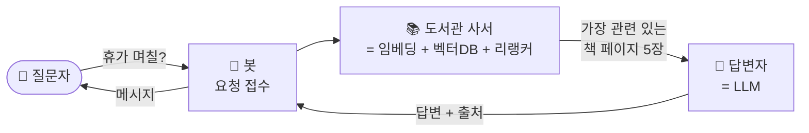
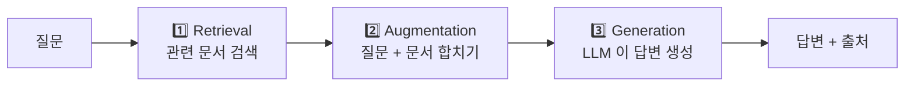
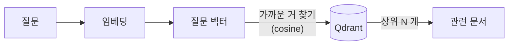
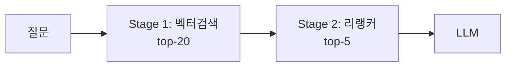
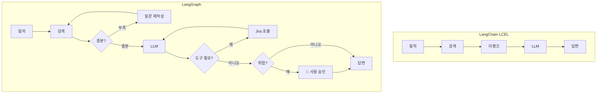
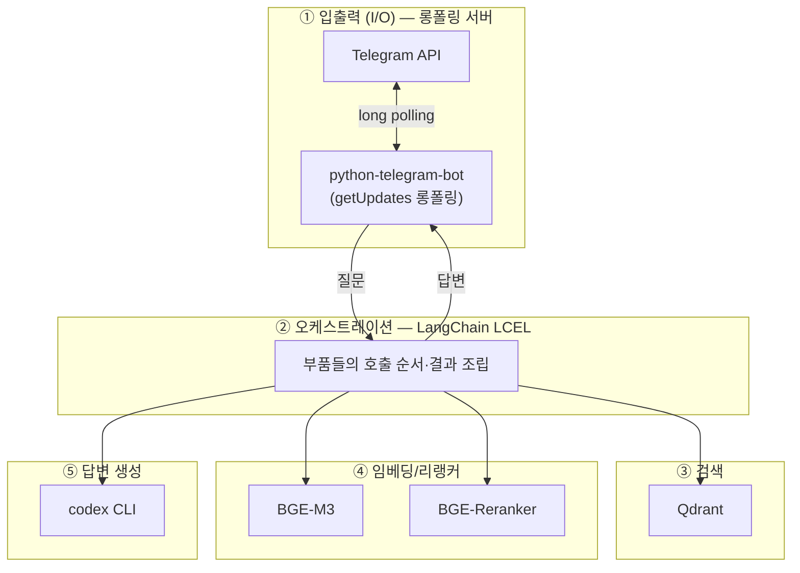

# 초심자를 위한 개념 가이드

> 이 문서는 *"이 프로젝트를 처음 본 사람"* 이 RAG / LangChain / LangGraph / 오케스트레이션 같은 용어를 헷갈리지 않게 설명합니다.
> 코드는 거의 안 나옵니다. 비유 → 정확한 정의 → 본 프로젝트 매핑 순서.

---

## 목차

1. [한 장으로 보는 전체 그림](#1-한-장으로-보는-전체-그림)
2. [RAG 가 뭐야?](#2-rag-가-뭐야)
3. [임베딩 / 벡터 DB / 유사도 검색](#3-임베딩--벡터-db--유사도-검색)
4. [리랭커는 또 뭐야?](#4-리랭커는-또-뭐야)
5. [LangChain 이 뭐야?](#5-langchain-이-뭐야)
6. [LangGraph 는 뭐야?](#6-langgraph-는-뭐야)
7. [오케스트레이션 ≠ 봇 서버](#7-오케스트레이션--봇-서버)
8. [다른 프레임워크와 비교 (Spring AI 등)](#8-다른-프레임워크와-비교-spring-ai-등)
9. [자주 헷갈리는 표현 사전](#9-자주-헷갈리는-표현-사전)
10. [본 프로젝트의 부품 매핑](#10-본-프로젝트의-부품-매핑)

---

## 1. 한 장으로 보는 전체 그림

> 비유 한 줄: **"도서관 사서 + 똑똑한 답변자가 한 팀으로 일한다."**



- **봇** = 사용자 입출력 담당 (Telegram 채팅 받고 답변 보냄)
- **사서** = 사내 문서 중에서 질문과 관련된 부분만 골라옴
- **답변자** = LLM (이 프로젝트는 codex CLI). 사서가 가져온 자료를 보고 답변 작성
- **이 전체를 조립하고 흐름 짜주는 게** = LangChain (오케스트레이션)

이게 **RAG (Retrieval-Augmented Generation)** 패턴입니다.

---

## 2. RAG 가 뭐야?

### 한 문장
**"LLM 에게 답변시키기 직전에 사내 문서를 검색해서 같이 보여주는 패턴"**

### 왜 필요한가
LLM (ChatGPT, Claude 등) 은 학습 데이터에 없는 정보 — 우리 회사 휴가 정책, 우리 팀의 코딩 규칙 — 을 모릅니다. 그냥 물으면 **모르거나 지어냅니다 (hallucination).**

해결: 답변 만들기 직전에 관련 문서를 찾아서 LLM 에게 *"이 문서들을 참고해서 답해라"* 라고 같이 줍니다.

### 흐름


### 비유
RAG = "오픈북 시험". LLM 은 학생, 사내 문서는 교과서. 질문 받으면 교과서에서 관련 페이지 펴 놓고 그걸 보면서 답변하게 함.

### 본 프로젝트가 RAG 인 이유
이 프로젝트의 모든 흐름이 1️⃣→2️⃣→3️⃣ 순서로 돌아갑니다. → **"이 프로젝트 = RAG 시스템"**.

---

## 3. 임베딩 / 벡터 DB / 유사도 검색

### 임베딩 (Embedding)
**문장을 의미 좌표(숫자 벡터)로 바꾸는 일.**

> 비유: 도서관에서 책마다 "분류 번호" 매기는 것. 단, 키워드가 아니라 *의미* 가 비슷한 책끼리 가까운 번호가 됨.

```
"신입사원 연차 며칠?"   →  [0.12, -0.34, 0.56, ..., 0.08]   (1024개의 숫자)
"입사 1년차 휴가 일수"  →  [0.11, -0.33, 0.57, ..., 0.07]   ← 거의 비슷
"VPN 어떻게 설정해?"    →  [0.88,  0.02, -0.41, ..., 0.55]   ← 매우 다름
```

본 프로젝트는 **`BAAI/bge-m3`** 모델로 임베딩 (1024 차원, 한국어 강함).

### 벡터 DB
**임베딩(=숫자 벡터)을 저장하고, "이 벡터와 가장 비슷한 거 찾아줘" 를 빠르게 하는 데이터베이스.**

> 비유: 도서관 분류 시스템. 책마다 분류 번호로 꽂혀 있고, "이 번호 근처 책 5권 줘" 하면 즉시 꺼내줌.

본 프로젝트는 **Qdrant** 사용.

### 유사도 검색 (Similarity Search)
질문 벡터와 가장 가까운 문서 벡터들을 cosine 거리로 골라오는 것.



→ 이 단계가 RAG 의 **"R" (Retrieval)**.

---

## 4. 리랭커는 또 뭐야?

### 문제
유사도 검색은 빠르지만 정밀하지 않을 때가 있습니다. 예: cosine 0.50 / 0.49 차이는 사실상 동률인데 실제로는 한쪽이 정답에 훨씬 가깝습니다.

### 해결: 2차 정제 (Reranking)
- 1차 (벡터 검색): "후보 20개" 빠르게 뽑음 — Qdrant 가 함
- 2차 (리랭커): 그 20개를 *질문과 짝지어서* 다시 점수 매김 — Cross-encoder 가 함
- 결과: 진짜 관련 있는 5개만 LLM 에 전달

### Bi-encoder vs Cross-encoder
| | Bi-encoder (= 임베더) | Cross-encoder (= 리랭커) |
|---|---|---|
| 입력 | 질문, 문서를 *따로* 임베딩 | (질문, 문서) *쌍을 같이* 입력 |
| 속도 | 빠름 (벡터 미리 만들어둠) | 느림 (쌍마다 새로 계산) |
| 정확도 | 보통 | 더 높음 |
| 본 프로젝트 | BGE-M3 | BGE-Reranker-v2-m3 |

> 비유: 사서가 도서 분류 번호로 5권 일단 골라옴 (빠름) → 사서가 직접 펼쳐 보고 진짜 답이 있는 3권만 추려줌 (정확).



---

## 5. LangChain 이 뭐야?

### 한 문장
**"LLM 앱 만들 때 자주 쓰는 부품들을 표준 인터페이스로 모아둔 라이브러리."**

### 왜 필요한가
RAG 같은 시스템을 직접 짜려면 다음을 다 짜야 합니다:
- OpenAI/Anthropic/local LLM 호출
- 임베딩 호출
- Qdrant/Pinecone/Chroma 호출
- 프롬프트 조립
- 출력 파싱
- 청크 분할
- 도구 호출 / 메모리 / 에이전트…

LangChain 은 **이걸 통일된 인터페이스로 미리 만들어둔 부품 카탈로그**.

### 핵심 개념: LCEL (LangChain Expression Language)
부품을 `|` 연산자로 연결해서 파이프라인을 만듦.

```python
chain = retriever | prompt | llm | output_parser
answer = chain.invoke("질문")
```

> 비유: 레고. 부품 모양이 다 표준화되어 있어서 끼워 맞추면 됨. LLM 을 OpenAI → Claude → 로컬 모델로 바꿔도 한 부품만 갈아끼우면 됨.

### LangChain 으로 만들 수 있는 것 (RAG 만이 아님)

| 만드는 것 | LangChain 부품 조합 |
|---|---|
| **RAG 챗봇** (이 프로젝트) | DocumentLoader + Splitter + Embeddings + VectorStore + Retriever + Prompt + LLM |
| 일반 챗봇 (대화 이력) | Prompt + LLM + Memory |
| 코드 에이전트 | Tool + Agent + LLM |
| 문서 요약기 | DocumentLoader + Prompt + LLM |
| SQL 자연어 쿼리 | Prompt + LLM + Tool(DB) + OutputParser |

### 정리
- **RAG** = 만든 것의 종류 (검색해서 답하는 시스템)
- **LangChain** = 만들 때 쓴 도구 (부품 라이브러리)
- 본 프로젝트 = "**LangChain 으로 만든 RAG 봇**"

---

## 6. LangGraph 는 뭐야?

### 한 문장
**"LangChain 의 형제 라이브러리. 단순 직선이 아니라 분기/루프/사람 승인 같은 복잡한 흐름이 필요할 때 쓴다."**

### LangChain LCEL vs LangGraph



### LangGraph 가 빛나는 순간
- "검색 결과 부족하면 질문 자동 재작성 후 재검색"
- "LLM 이 도구 호출하고 그 결과를 보고 다시 추론" (ReAct 에이전트)
- "위험한 액션은 사람 버튼 승인 후 진행"
- 여러 에이전트가 협업

### 본 프로젝트는 LangGraph **사용 안 함**
이유: 흐름이 단순한 선형 (검색 → 리랭크 → 답변). 분기·루프 없음. 가이드 문서가 *"LangGraph 미사용. 단순 함수 호출 체인으로 시작"* 원칙을 권장했고 그대로 따랐습니다.

`docs/ARCHITECTURE.md §12 확장 포인트` 의 "분기 흐름 필요 시" 항목에 LangGraph 도입 조건이 명시되어 있습니다.

---

## 7. 오케스트레이션 ≠ 봇 서버

이 두 단어는 자주 같이 등장하지만 **다른 계층** 입니다. 본 프로젝트를 5계층으로 분리하면 명확해집니다:



| 계층 | 정체 | 본 프로젝트 |
|---|---|---|
| **롱폴링 (I/O)** | Telegram 과 입출력만 담당 | `python-telegram-bot` 의 `Application.run_polling()` |
| **오케스트레이션** | "어느 부품을 어떤 순서로 호출하지" 정의 | `rag.py` 의 LCEL 체인 |

→ 입출력 계층(Telegram)을 **Slack 봇이나 HTTP API 로 바꿔도** 오케스트레이션 코드는 그대로 재사용 됩니다. 거꾸로 LLM/벡터DB 를 바꿔도 봇 코드는 그대로.

---

## 8. 다른 프레임워크와 비교 (Spring AI 등)

LangChain 의 역할 = **"Java 진영의 Spring AI 와 거의 동일한 포지셔닝"**.

### 1:1 컴포넌트 매핑

| 역할 | Spring AI (Java/Kotlin) | LangChain (Python) |
|---|---|---|
| LLM 추상화 | `ChatClient` / `ChatModel` | `BaseChatModel` |
| 임베딩 | `EmbeddingModel` | `Embeddings` |
| 벡터스토어 | `VectorStore` | `VectorStore` |
| 문서 모델 | `Document` | `Document` |
| 문서 로더 | `DocumentReader` | `DocumentLoader` |
| 청크 분할 | `TextSplitter` | `TextSplitter` |
| 프롬프트 | `PromptTemplate` | `ChatPromptTemplate` |
| 출력 파싱 | `OutputConverter` | `OutputParser` |
| 도구 호출 | `@Tool` | `@tool` / `bind_tools` |
| 메모리 | `ChatMemory` | `BaseChatMessageHistory` |
| RAG 헬퍼 | `QuestionAnswerAdvisor` | `RetrievalQA` / LCEL |
| 미들웨어 | `Advisors` (인터셉터 체인) | `Runnable` (함수 합성) |
| 분기 흐름 | (실험적) | LangGraph |

### 같은 RAG 흐름

```kotlin
// Spring AI (Kotlin)
chatClient.prompt().user(query).call().content()
```

```python
# LangChain (Python) — 본 프로젝트의 패턴
chain = ({"context": retriever, "question": RunnablePassthrough()}
         | prompt | model | StrOutputParser())
chain.invoke(query)
```

### 차이점
| 축 | Spring AI | LangChain |
|---|---|---|
| 언어 | Java/Kotlin | Python (+ JS/TS) |
| 진화 속도 | 보수적 (분기 단위) | 빠름 (월 단위 breaking change 흔함) |
| 통합 부품 수 | 수십 | **수백** |
| 엔터프라이즈 친화도 | 높음 (Spring Boot 표준) | 중간 (LangSmith 별도 SaaS) |
| 데이터 사이언스 친화도 | 낮음 | 높음 |

### 결론
**Spring AI 알면 LangChain 컨셉 90% 바로 옮겨감.** 부품 이름과 표현 방식만 다를 뿐 추상화 모델이 거의 같음.

---

## 9. 자주 헷갈리는 표현 사전

| 막연한 표현 | 정확한 의미 | 어디서 처리되나 (본 프로젝트) |
|---|---|---|
| "이 RAG 시스템" | RAG 패턴을 LangChain 으로 구현한 챗봇 | 전체 |
| "체인" / "파이프라인" | LCEL 로 조립된 Runnable 합성체 | `rag.py` |
| "오케스트레이션" | 부품들의 호출 순서·결과 조립 | LangChain (rag.py) |
| "검색" / "유사도 검색" | 벡터 cosine 비교 | Qdrant |
| "리랭킹" / "정제" | (질문, 문서) 쌍 점수 매김 | BGE-Reranker |
| "추론" / "답변 생성" | LLM 이 답변 문장 작성 | codex CLI |
| "롱폴링" | Telegram 에 주기적으로 새 메시지 있는지 묻는 것 | python-telegram-bot |
| "임베딩" | 문장 → 1024차원 벡터 | BGE-M3 |
| "청크 / chunk" | 문서를 자른 조각 (검색 단위) | RecursiveCharacterTextSplitter |
| "에이전트" | LLM 이 도구를 골라가며 행동하는 패턴 | (본 프로젝트는 미사용) |
| "할루시네이션 (hallucination)" | LLM 이 모르는데 그럴듯하게 지어내는 현상 | RAG 가 줄여줌, 본 시스템은 거부 응답으로 추가 차단 |

---

## 10. 본 프로젝트의 부품 매핑

| 추상 개념 | 본 프로젝트 구현체 | 코드 위치 |
|---|---|---|
| **봇 입출력** | python-telegram-bot (long polling) | `app/bot.py` |
| **오케스트레이션** | LangChain LCEL | `app/rag.py:_build_chain()` |
| **임베더** | BAAI/bge-m3 (HuggingFace, 로컬) | `app/embeddings.py` |
| **벡터 DB** | Qdrant (Podman 컨테이너) | `docker-compose.yml`, `app/rag.py` |
| **리트리버** | `vectorstore.as_retriever(k=20)` | `app/rag.py` |
| **리랭커** | BAAI/bge-reranker-v2-m3 (cross-encoder, 로컬) | `app/rag.py` (`CrossEncoderReranker`) |
| **프롬프트** | 시스템 프롬프트 + 컨텍스트 템플릿 | `app/rag.py` (`SYSTEM_PROMPT`, `PROMPT_TEMPLATE`) |
| **LLM** | codex CLI (subprocess) | `app/rag.py:call_llm_cli()` |
| **문서 로더** | LangChain `TextLoader` (.md 전용) | `app/ingest.py` |
| **청크 분할** | `RecursiveCharacterTextSplitter` (chunk=500, overlap=50) | `app/ingest.py`, `app/indexer.py` |
| **수동 인덱싱** | `ingest.py` 가 컬렉션 통째 재생성 | `scripts/ingest.sh` |
| **자동 인덱싱 A** | watchdog Observer (`data/docs/` 감시) | `app/watcher.py` |
| **자동 인덱싱 C** | Telegram .md 첨부 핸들러 | `app/bot.py:document_handler()` |
| **증분 인덱싱 핵심** | source 단위 delete + add | `app/indexer.py` |

이 표만 외워두시면 **"어느 개념이 어느 파일에 있는지"** 즉시 찾으실 수 있습니다.

---

## 다음 단계

- **사용법 / 설치** → `README.md`
- **상세 설계 / 다이어그램 / 환경변수** → `docs/ARCHITECTURE.md`
- **테스트 시나리오** → `tests/scenarios.md`
